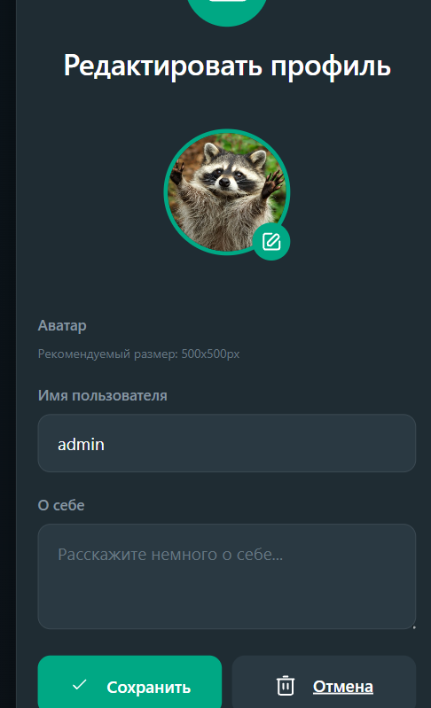

# Gamma Messenger

<div align="center">
  
  
  
  
  
  

  <h3>Современный мессенджер с групповыми чатами, файлообменником и real-time обновлениями</h3>

  [Мессенджер](https://chat.termux.ru) • 

</div>

---

##  Возможности

<table>
  <tr>
    <td width="50%">
      <h3 align="center"> Личные сообщения</h3>
      <p align="center">Приватные чаты между пользователями с отметками о прочтении</p>
    </td>
    <td width="50%">
      <h3 align="center"> Групповые чаты</h3>
      <p align="center">Создавайте группы с друзьями, коллегами или по интересам</p>
    </td>
  </tr>
  <tr>
    <td width="50%">
      <h3 align="center"> Файлообменник</h3>
      <p align="center">Отправляйте файлы до 500 МБ — изображения, документы, архивы</p>
    </td>
    <td width="50%">
      <h3 align="center"> Превью ссылок</h3>
      <p align="center">Автоматическое извлечение заголовков и картинок из ссылок</p>
    </td>
  </tr>
  <tr>
    <td width="50%">
      <h3 align="center"> Ответы на сообщения</h3>
      <p align="center">Цитируйте и отвечайте на конкретные сообщения</p>
    </td>
    <td width="50%">
      <h3 align="center"> Пересылка</h3>
      <p align="center">Пересылайте сообщения между чатами и группами</p>
    </td>
  </tr>
  <tr>
    <td width="50%">
      <h3 align="center"> Контекстное меню</h3>
      <p align="center">ПКМ для быстрого доступа к действиям с сообщением</p>
    </td>
    <td width="50%">
      <h3 align="center"> Адаптивный дизайн</h3>
      <p align="center">Отлично выглядит на всех устройствах</p>
    </td>
  </tr>
</table>

---

##  Скриншоты

<div align="center">
  <table>
    <tr>
      <td align="center">
        
        <br>
        <em> Страница входа</em>
      </td>
      <td align="center">
        
        <br>
        <em> Профиль пользователя</em>
      </td>
    </tr>
    <tr>
      <td align="center">
        
        <br>
        <em> Редактирование профиля</em>
      </td>
      <td align="center">
        
        <br>
        <em> Участники группы</em>
      </td>
    </tr>
    <tr>
      <td align="center">
        
        <br>
        <em> Редактирование группы</em>
      </td>
      <td align="center">
        
        <br>
        <em> Личный чат</em>
      </td>
    </tr>
  </table>
</div>

---

##  Быстрый старт

### Предварительные требования
- Python 3.9 или выше
- pip (менеджер пакетов Python)
- Git

### Установка

Установка на Linux: Debian/Ubuntu
``` bash
curl -o run_linux.sh https://raw.githubusercontent.com/Iaroslav-Palekhov/gamma-messenger/refs/heads/main/run_linux.sh
sudo chmod +x ./run_linux.sh
sudo ./run_linux.sh
```

Установка на Windows
скачайте этот файл и запустите
[blob:https://github.com/806a3ea3-3619-46c5-a2e0-b1d69816526b](https://github.com/Iaroslav-Palekhov/gamma-messenger/blob/main/run_windows.bat)


```bash
# Клонирование репозитория
git clone https://github.com/Iaroslav-Palekhov/gamma-messenger.git
cd gamma-messenger

# Создание виртуального окружения (рекомендуется)
python -m venv venv

# Активация виртуального окружения
# На Windows:
venv\Scripts\activate
# На Linux/Mac:
source venv/bin/activate

# Установка зависимостей
pip install -r requirements.txt

# Запуск приложения
python app.py
```
